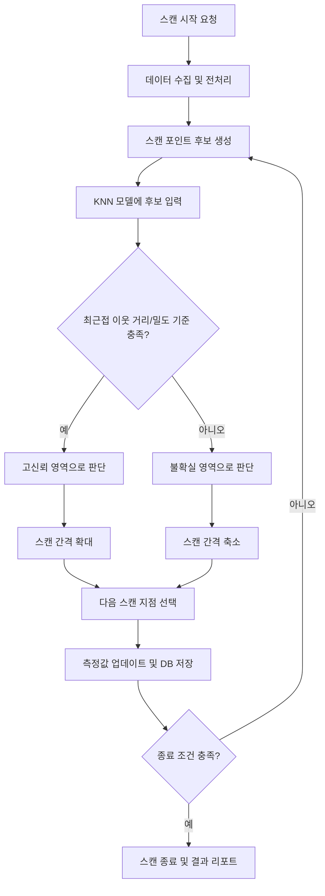

# Bayesian Inference Experiments

This repository explores ideas for using **Bayesian Inference** to perform measurement and exploration **efficiently, only where needed**.

## Project Overview

The repository includes multiple datasets and Jupyter Notebook experiments, covering
model comparisons and hyperparameter search in classification tasks (e.g., KNN and Bayesian Optimization experiments).

## Repository Structure

### Notebooks
- `20240821_pm_Bayesian_knn_gp.ipynb`: Early experiments related to Bayesian + KNN + GP
- `20240912_BO_knn.ipynb`: KNN experiments based on Bayesian Optimization
- `20240918_multi_knn_cl.ipynb`: Multi-KNN classification experiments
- `20250804_spiral.ipynb`, `20250804pm_spiral.ipynb`: Experiments using spiral data

### Datasets
- `breast-cancer-wisconsin.data.csv`
- `balance-scale.data.csv`
- `haberman.data.csv`
- `sonar.all-data.csv`
- `letter-recognition.data.csv`

## How to Run

1. Create and activate a Python virtual environment
   ```bash
   python -m venv .venv
   source .venv/bin/activate
   ```
2. Install Jupyter and required libraries
   ```bash
   pip install jupyter pandas numpy scikit-learn matplotlib
   ```
3. Launch Jupyter Notebook
   ```bash
   jupyter notebook
   ```

## Goals

- Explore methods to improve learning/search efficiency while quantifying uncertainty
- Evaluate performance and characteristics of Bayesian-based approaches across various datasets

## Notes

This repository is a notebook-centered project for research and experimentation.
Detailed descriptions of each experiment are documented in the markdown/code cells of each notebook.

## KNN 기반 스캔 방식 Mermaid Diagram


